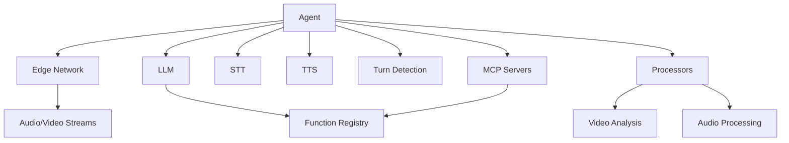
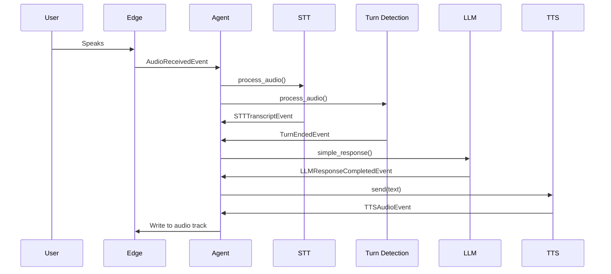

The `Agent` class is the heart of Vision Agents. It orchestrates all components needed to build real-time multimodal AI applications, coordinating edge networks, LLMs, processors, and conversational flows.

## Overview

An Agent manages the complete lifecycle of a real-time AI interaction:

- Joins video/audio calls via edge networks
- Routes audio through STT → LLM → TTS pipeline (or uses realtime LLMs)
- Processes video streams with custom processors
- Handles turn detection and conversational flow
- Manages function calling and tool execution
- Maintains conversation history and chat integration

## Architecture



## Basic Usage

### Realtime Mode

With realtime LLMs (like Gemini Realtime), the agent handles audio directly without separate STT/TTS:

```python
from vision_agents import Agent
from vision_agents.edge import getstream
from vision_agents.llm import gemini
from vision_agents.core.edge.types import User

agent = Agent(
    edge=getstream.Edge(),
    agent_user=User(id="agent-1", name="AI Assistant"),
    instructions="You are a helpful voice assistant. Keep responses concise.",
    llm=gemini.Realtime(),
    processors=[],  # Optional video/audio processors
)

# Join a call
async with agent.join(call):
    await agent.finish()  # Wait for call to end
```

### Interval Mode

For traditional LLMs, you provide separate STT, TTS, and turn detection:

```python
from vision_agents.stt import deepgram
from vision_agents.tts import elevenlabs
from vision_agents.turn_detection import silero
from vision_agents.llm import openai

agent = Agent(
    edge=getstream.Edge(),
    agent_user=User(id="agent-1", name="AI Assistant"),
    instructions="You are a helpful assistant.",
    llm=openai.LLM(model="gpt-4o"),
    stt=deepgram.STT(),
    tts=elevenlabs.TTS(),
    turn_detection=silero.TurnDetector(),
)

async with agent.join(call):
    await agent.finish()
```

## Key Components

### Edge Network

Handles real-time audio/video transport. See [Edge Networks](/concepts/edge-networks).

```python
from vision_agents.edge import getstream

edge = getstream.Edge()
```

### LLM Integration

The brain of your agent. Can be:
- **Standard LLM**: Requires STT/TTS (OpenAI, Anthropic, Google)
- **Audio LLM**: Processes audio directly (OpenAI Realtime)
- **Video LLM**: Can analyze video streams (Gemini)
- **Omni LLM**: Handles both audio and video (Gemini Realtime)

### Processors

Extend agent capabilities with custom processing. See [Processors](/concepts/processors).

```python
from my_processors import ObjectDetector, SentimentAnalyzer

agent = Agent(
    # ... other config
    processors=[
        ObjectDetector(),
        SentimentAnalyzer(),
    ]
)
```

### MCP Servers

Provide external tool access via Model Context Protocol:

```python
from vision_agents.mcp import FileSystemServer, WebSearchServer

agent = Agent(
    # ... other config
    mcp_servers=[
        FileSystemServer(),
        WebSearchServer(),
    ]
)
```

## Agent Lifecycle

### Initialization

When you create an `Agent`, it:

1. Validates configuration (ensures realtime LLMs don't have STT/TTS)
2. Sets up event managers and merges events from all plugins
3. Prepares RTC tracks for audio/video
4. Attaches processors to the agent
5. Initializes the MCP manager if servers are provided

<Note>
Don't reuse agent objects. Create a new `Agent` instance for each call session.
</Note>

### Joining a Call

The `join()` method is an async context manager:

```python
async with agent.join(call, participant_wait_timeout=10.0) as session:
    # Agent is now connected
    await agent.simple_response("Hello! How can I help?")
    
    # Wait for call to end naturally
    await agent.finish()
# Agent automatically closes after context exits
```

**What happens during join:**

1. Starts tracing for observability
2. Connects to MCP servers
3. Connects realtime LLM (if applicable)
4. Authenticates agent user with edge network
5. Establishes RTC connection
6. Publishes audio/video tracks
7. Creates conversation for chat integration
8. Waits for participants (configurable timeout)
9. Starts consuming incoming audio
10. Starts metrics broadcast (if enabled)

**Reference:** `agents.py:615-711`

### Event Flow

The agent orchestrates events across all components:



**Reference:** `agents.py:323-476`

### Cleanup

The agent cleans up automatically when the context manager exits:

```python
async def _close(self):
    # Stop audio consumer
    # Stop metrics broadcast
    # Call stop() and close() on all plugins
    # Disconnect MCP servers
    # Stop video forwarders
    # Close RTC connection
    # Stop audio/video tracks
```

**Reference:** `agents.py:864-917`

## Advanced Features

### Streaming TTS

Reduce latency by streaming LLM chunks to TTS as sentences complete:

```python
agent = Agent(
    # ... other config
    streaming_tts=True,  # Stream to TTS at sentence boundaries
)
```

The agent accumulates LLM response chunks and sends complete sentences to TTS immediately, rather than waiting for the full response.

**Reference:** `agents.py:363-383`

### Multi-Speaker Handling

Automatically handle multiple participants with audio filtering:

```python
from vision_agents.utils.audio_filter import FirstSpeakerWinsFilter

agent = Agent(
    # ... other config
    multi_speaker_filter=FirstSpeakerWinsFilter(),  # Default
)
```

The filter uses VAD to lock onto the first speaker and drops overlapping audio from others.

**Reference:** `agents.py:194-196`

### Metrics Broadcasting

Broadcast agent metrics to call participants:

```python
agent = Agent(
    # ... other config
    broadcast_metrics=True,
    broadcast_metrics_interval=5.0,  # seconds
)
```

### Programmatic Agent Speech

Make the agent say something directly:

```python
await agent.say(
    "I've processed your request.",
    user_id="agent-1",
    metadata={"action": "confirmation"}
)
```

**Reference:** `agents.py:1026-1062`

## Configuration Options

### Constructor Parameters

| Parameter | Type | Description |
|-----------|------|-------------|
| `edge` | `EdgeTransport` | Edge network for audio/video transport |
| `llm` | `LLM \| AudioLLM \| VideoLLM` | Language model (with optional audio/video) |
| `agent_user` | `User` | Agent's identity |
| `instructions` | `str` | System prompt (supports `@file.md` references) |
| `stt` | `Optional[STT]` | Speech-to-text (not needed for realtime LLMs) |
| `tts` | `Optional[TTS]` | Text-to-speech (not needed for realtime LLMs) |
| `turn_detection` | `Optional[TurnDetector]` | Conversational turn detection |
| `processors` | `Optional[List[Processor]]` | Custom audio/video processors |
| `mcp_servers` | `Optional[List[MCPBaseServer]]` | MCP servers for tools |
| `options` | `Optional[AgentOptions]` | Advanced configuration |
| `streaming_tts` | `bool` | Stream LLM chunks to TTS (default: False) |
| `broadcast_metrics` | `bool` | Broadcast metrics to participants (default: False) |
| `multi_speaker_filter` | `Optional[AudioFilter]` | Multi-speaker audio filter |

**Reference:** `agents.py:109-171`

### Agent Options

```python
from vision_agents.core.agents.agent_types import AgentOptions

options = AgentOptions(
    model_dir="/path/to/models",  # Directory for cached models
)

agent = Agent(
    # ... other config
    options=options
)
```

**Reference:** `agent_types.py:15-26`

## Event Subscriptions

Subscribe to agent-wide events:

```python
@agent.subscribe
async def on_llm_response(event: LLMResponseCompletedEvent):
    print(f"Agent said: {event.text}")

@agent.subscribe
async def on_user_transcript(event: STTTranscriptEvent):
    print(f"User said: {event.text}")
```

The event bus merges events from all plugins (edge, LLM, STT, TTS, turn detection, processors).

**Reference:** `agents.py:600-612`

## Observability

### OpenTelemetry Tracing

The agent automatically creates spans for key operations:

```python
from opentelemetry import trace

tracer = trace.get_tracer("my-app")

agent = Agent(
    # ... other config
    tracer=tracer,
)
```

Key spans include:
- `join` - Full call lifecycle
- `edge.authenticate` - Authentication
- `edge.join` - Network connection
- `simple_response` - LLM interactions
- Conversation sync operations

### Metrics Collection

Agent metrics are automatically collected:

```python
metrics = agent._metrics  # AgentMetrics instance
# Includes latency, token usage, error rates, etc.
```

## Code References

All code examples are based on the actual implementation:

- **Agent class**: `agents-core/vision_agents/core/agents/agents.py:82-917`
- **Agent types**: `agents-core/vision_agents/core/agents/agent_types.py`
- **Event handling**: `agents.py:323-577`
- **Join flow**: `agents.py:615-711`
- **Cleanup**: `agents.py:838-917`

## Best Practices

<Warning>
**Never reuse Agent instances.** Create a new agent for each call session. The agent manages state that should not be shared across calls.
</Warning>

1. **Use context managers**: Always use `async with agent.join(call)` to ensure proper cleanup
2. **Handle errors gracefully**: Wrap agent operations in try/except blocks
3. **Choose the right LLM mode**: Use realtime LLMs for lowest latency
4. **Configure timeouts**: Set appropriate `participant_wait_timeout` for your use case
5. **Monitor metrics**: Enable metrics broadcasting for production observability
6. **Leverage processors**: Use processors for video analysis, not LLM function calls
7. **Use MCP for tools**: Prefer MCP servers over custom function implementations

## Next Steps

- Learn about [Edge Networks](/concepts/edge-networks) for real-time transport
- Explore [Processors](/concepts/processors) for custom logic
- Understand [Turn Detection](/concepts/turn-detection) for natural conversations
- Compare [Realtime vs Interval](/concepts/realtime-vs-interval) modes
- Implement [Function Calling](/concepts/function-calling) for tool use