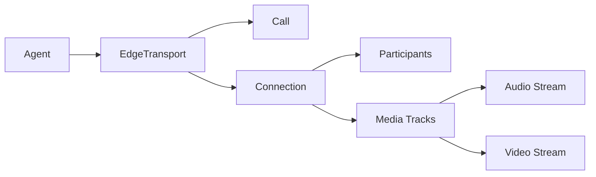

Edge Networks provide the real-time communication layer that connects your agents to users via WebRTC. They handle audio/video streaming, participant management, and call orchestration.

## Overview

An `EdgeTransport` abstracts the underlying WebRTC infrastructure, allowing agents to join calls, publish media tracks, and receive audio/video streams without managing low-level connection details.

## Architecture



## EdgeTransport Interface

The `EdgeTransport` abstract base class defines the contract for all edge network implementations:

```python
from vision_agents.core.edge import EdgeTransport
from vision_agents.core.edge.types import User, Connection
from vision_agents.core.edge.call import Call

class CustomEdge(EdgeTransport):
    async def authenticate(self, user: User) -> None:
        """Authenticate agent user with the transport."""
        
    async def create_call(self, call_id: str, **kwargs) -> Call:
        """Create or retrieve a call."""
        
    async def join(self, agent: Agent, call: Call, **kwargs) -> Connection:
        """Join a call and establish connection."""
        
    async def publish_tracks(
        self,
        audio_track: Optional[MediaStreamTrack],
        video_track: Optional[MediaStreamTrack],
    ):
        """Publish audio/video tracks to the call."""
        
    async def close(self):
        """Clean up all resources."""
```

**Reference:** `edge_transport.py:23-146`

## Required Events

All `EdgeTransport` implementations must emit these events:

```python
from vision_agents.core.edge.events import (
    AudioReceivedEvent,
    TrackAddedEvent,
    TrackRemovedEvent,
    CallEndedEvent,
)

class EdgeTransport:
    def __init__(self):
        self.events = EventManager()
        self.events.register(
            AudioReceivedEvent,     # Audio received from participant
            TrackAddedEvent,        # Media track added to call
            TrackRemovedEvent,      # Media track removed
            CallEndedEvent,         # Call ended
        )
```

**Reference:** `edge_transport.py:33-44`

## Core Types

### User

Represents an agent or human user:

```python
from vision_agents.core.edge.types import User

agent_user = User(
    id="agent-123",
    name="AI Assistant",
    image="https://example.com/avatar.png",  # Optional
)
```

**Reference:** `types.py:8-12`

### Participant

Represents someone currently in a call:

```python
from vision_agents.core.edge.types import Participant

@dataclass
class Participant:
    original: Any            # Provider-specific participant object
    user_id: str            # User identifier (not necessarily unique)
    id: str                 # Unique participant ID for this call
```

**Reference:** `types.py:15-19`

### Connection

Manages the lifecycle of an active call session:

```python
class Connection(abc.ABC):
    async def close(self) -> None:
        """Close the connection and clean up."""
    
    async def wait_for_participant(
        self, 
        timeout: Optional[float] = None
    ) -> None:
        """Wait for a participant to join."""
    
    def idle_since(self) -> float:
        """Timestamp when all participants left (or 0.0 if active)."""
```

**Reference:** `types.py:29-80`

### TrackType

Enumeration of media track types:

```python
class TrackType(enum.IntEnum):
    UNSPECIFIED = 0
    AUDIO = 1
    VIDEO = 2
    SCREEN_SHARE = 3
    SCREEN_SHARE_AUDIO = 4
```

**Reference:** `types.py:21-27`

## Using GetStream Edge

Vision Agents provides a production-ready GetStream implementation:

```python
from vision_agents.edge import getstream
from vision_agents.core.edge.types import User

# Initialize edge
edge = getstream.Edge()

# Create agent user
agent_user = User(
    id="agent-1",
    name="Voice Assistant",
)

# Create agent with edge
from vision_agents import Agent

agent = Agent(
    edge=edge,
    agent_user=agent_user,
    # ... other config
)
```

## Call Management

### Creating a Call

Create a new call or retrieve an existing one:

```python
# Agent handles authentication automatically
call = await agent.create_call(
    call_type="audio_room",
    call_id="support-session-123",
)
```

The agent authenticates the user if not already done.

**Reference:** `agents.py:955-964`

### Joining a Call

Join an existing call:

```python
async with agent.join(call, participant_wait_timeout=10.0):
    # Agent is now connected to the call
    await agent.finish()
```

**What happens:**
1. Agent authenticates with edge network
2. Edge transport joins the call
3. Audio/video tracks are published
4. Agent waits for participants (optional timeout)
5. Incoming audio consumption starts

**Reference:** `agents.py:615-711`

### Waiting for Participants

Wait for other participants to join:

```python
async with agent.join(call, participant_wait_timeout=30.0):
    # Waits up to 30 seconds for a participant
    # Proceeds after timeout even if no one joins
    await agent.finish()

# Or wait manually
await agent.wait_for_participant(timeout=60.0)
```

**Reference:** `agents.py:713-733`

## Connection Lifecycle

### Connection States

A connection goes through these states:

1. **Establishing** - `join()` in progress
2. **Waiting** - Waiting for participants
3. **Active** - Participants present, media flowing
4. **Idle** - All participants left
5. **Closed** - Connection terminated

### Idle Detection

Check if the connection is idle (no participants):

```python
idle_duration = agent.idle_for()

if idle_duration > 300:  # 5 minutes
    print("No participants for 5 minutes, closing call")
    await agent.close()
```

**Reference:** `agents.py:734-756`

### Call Duration

Track how long the agent has been on the call:

```python
duration = agent.on_call_for()
print(f"Agent has been on call for {duration:.1f} seconds")
```

**Reference:** `agents.py:757-768`

## Media Track Management

### Publishing Tracks

The agent automatically publishes audio/video tracks during join:

```python
# In agent.join():
audio_track = self._audio_track if self.publish_audio else None
video_track = self._video_track if self.publish_video else None

if audio_track or video_track:
    await self.edge.publish_tracks(audio_track, video_track)
```

You typically don't call this directly.

**Reference:** `agents.py:665-670`

### Subscribing to Tracks

The agent automatically subscribes to incoming video tracks:

```python
@edge.events.subscribe
async def on_video_track_added(event: TrackAddedEvent):
    if event.track_type in (TrackType.VIDEO, TrackType.SCREEN_SHARE):
        # Subscribe to video track
        track = edge.add_track_subscriber(event.track_id)
        # Process with video processors or LLM
```

**Reference:** `agents.py:1255-1300`

### Track Priority

Screen shares have higher priority than regular video:

```python
# From TrackInfo
priority = 1 if track_type == TrackType.SCREEN_SHARE else 0
```

The agent automatically routes the highest-priority track to video processors and video-capable LLMs.

**Reference:** `agents.py:1295`

## Audio Processing

Edge networks deliver audio via `AudioReceivedEvent`:

```python
@edge.events.subscribe
async def on_audio_received(event: AudioReceivedEvent):
    if event.pcm_data and event.participant:
        # Audio is buffered per-participant
        # Agent processes audio in 20ms chunks
        await process_audio_chunk(event.pcm_data)
```

**Reference:** `agents.py:417-430`

### Per-Participant Audio Queues

The agent maintains separate audio queues for each participant:

```python
# Internal implementation
self._participant_queues: dict[str, tuple[Participant, AudioQueue]] = {}
```

This enables multi-speaker support with audio filtering.

**Reference:** `agents.py:190-191`

## Custom Events

Send custom data to all call participants:

```python
await edge.send_custom_event({
    "type": "agent_metric",
    "latency_ms": 120,
    "confidence": 0.95,
})
```

<Note>
Custom events must be JSON-serializable and under 5KB.
</Note>

**Reference:** `edge_transport.py:139-145`

## Conversation Integration

Create a conversation for chat features:

```python
# Agent handles this automatically during join:
self.conversation = await self.edge.create_conversation(
    call,
    self.agent_user,
    self.instructions.full_reference,
)

# Provide conversation to LLM
self.llm.set_conversation(self.conversation)
```

**Reference:** `agents.py:673-678`

## Opening Demo UI

Some edge implementations provide a demo UI:

```python
edge.open_demo(
    call_id="my-call-123",
    token="user-token",
)
```

This is transport-specific and typically opens a browser.

**Reference:** `edge_transport.py:87-94`

## Error Handling

### Connection Failures

Handle connection errors gracefully:

```python
try:
    async with agent.join(call):
        await agent.finish()
except ConnectionError as e:
    logger.error(f"Failed to connect: {e}")
    # Retry logic or fallback
except asyncio.TimeoutError:
    logger.error("Connection timeout")
```

### Call Ended Events

React to call termination:

```python
@edge.events.subscribe
async def on_call_ended(event: CallEndedEvent):
    logger.info("Call ended, cleaning up")
    await agent.close()
```

**Reference:** `agents.py:432-437`

## Best Practices

1. **Reuse edge instances**: Create one `EdgeTransport` and reuse it across agents
2. **Set appropriate timeouts**: Configure `participant_wait_timeout` based on your use case
3. **Monitor connection state**: Use `idle_for()` to detect abandoned calls
4. **Handle disconnections**: Subscribe to `CallEndedEvent` for cleanup
5. **Use connection context managers**: Always use `async with agent.join()`
6. **Clean up properly**: Let the context manager handle cleanup automatically

## Implementation Guide

### Creating a Custom Edge Transport

To support a new WebRTC provider:

```python
from vision_agents.core.edge import EdgeTransport
from vision_agents.core.edge.types import User, Connection
from vision_agents.core.edge.call import Call

class MyCustomEdge(EdgeTransport):
    async def authenticate(self, user: User) -> None:
        # Authenticate with your service
        self.token = await my_service.authenticate(user)
    
    async def create_call(self, call_id: str, **kwargs) -> Call:
        # Create call via your API
        response = await my_service.create_call(call_id)
        return Call(id=call_id, response=response)
    
    async def join(self, agent, call, **kwargs) -> Connection:
        # Establish WebRTC connection
        connection = await my_service.join(call.id, self.token)
        
        # Emit events as audio arrives
        self.events.send(AudioReceivedEvent(...))
        
        return MyConnection(connection)
    
    async def publish_tracks(self, audio_track, video_track):
        # Publish tracks to the call
        await my_service.publish(audio_track, video_track)
    
    async def close(self):
        # Clean up resources
        await my_service.disconnect()
```

<Warning>
Ensure your implementation emits all required events: `AudioReceivedEvent`, `TrackAddedEvent`, `TrackRemovedEvent`, and `CallEndedEvent`.
</Warning>

## Code References

- **EdgeTransport interface**: `edge_transport.py:23-146`
- **Core types**: `types.py:1-80`
- **Agent integration**: `agents.py:615-711`
- **Event handling**: `events.py`

## Next Steps

- Learn about [Agents](/concepts/agents) orchestration
- Explore [Processors](/concepts/processors) for media processing
- Understand [Turn Detection](/concepts/turn-detection) for conversational flow