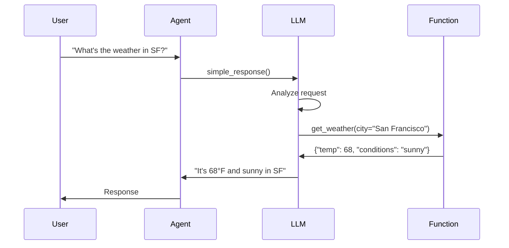

Function calling allows LLMs to invoke Python functions to retrieve data, perform actions, or integrate with external services. This enables agents to go beyond text generation and interact with the real world.

## Overview

When you register functions with an LLM, the model can:

- Decide when to call functions based on conversation context
- Extract arguments from user requests
- Execute functions with proper parameters
- Use function results to generate informed responses



## Function Registry

All LLMs have a built-in function registry:

```python
from vision_agents.core.llm import LLM

class MyLLM(LLM):
    def __init__(self):
        super().__init__()
        # self.function_registry is automatically created
```

**Reference:** `llm.py:54-61`, `function_registry.py:47-288`

## Registering Functions

### Using the Decorator

Register functions using the `@llm.register_function` decorator:

```python
from vision_agents.llm import openai

llm = openai.LLM(model="gpt-4o")

@llm.register_function(
    name="get_weather",  # Optional, defaults to function name
    description="Get current weather for a city",  # Optional, from docstring
)
async def get_weather(city: str, units: str = "fahrenheit") -> dict:
    """Fetch weather data for a city.
    
    Args:
        city: City name
        units: Temperature units (fahrenheit or celsius)
    
    Returns:
        Weather data including temperature and conditions
    """
    # Call weather API
    response = await weather_api.get(city, units)
    return {
        "temperature": response.temp,
        "conditions": response.conditions,
        "humidity": response.humidity,
    }
```

**Reference:** `llm.py:185-198`, `function_registry.py:53-136`

### Requirements

<Warning>
All registered functions **must** be async. Synchronous functions will raise a `ValueError`.
</Warning>

```python
# ✅ Correct
@llm.register_function()
async def fetch_data(query: str) -> dict:
    return await api.get(query)

# ❌ Wrong - will raise ValueError
@llm.register_function()
def fetch_data(query: str) -> dict:
    return api.get_sync(query)
```

**Reference:** `function_registry.py:73-77`

### Type Hints

The registry uses type hints to generate JSON schemas:

```python
from typing import List, Optional

@llm.register_function()
async def search_products(
    query: str,
    max_results: int = 10,
    categories: Optional[List[str]] = None,
) -> List[dict]:
    """Search for products."""
    # Type hints are converted to JSON schema:
    # query: {"type": "string"}
    # max_results: {"type": "integer"}
    # categories: {"type": "array", "items": {"type": "string"}}
    pass
```

**Reference:** `function_registry.py:243-283`

### Supported Types

The registry converts Python types to JSON schema:

| Python Type | JSON Schema |
|-------------|-------------|
| `str` | `{"type": "string"}` |
| `int` | `{"type": "integer"}` |
| `float` | `{"type": "number"}` |
| `bool` | `{"type": "boolean"}` |
| `list`, `List` | `{"type": "array"}` |
| `dict`, `Dict` | `{"type": "object"}` |
| `Optional[T]` | Same as `T` (nullable) |
| `Enum` | `{"type": "string", "enum": [...]}` |

**Reference:** `function_registry.py:243-283`

## Function Execution

### Automatic Execution

When the LLM decides to call functions, the agent automatically:

1. Extracts tool calls from LLM response
2. Deduplicates calls (same id/name/args)
3. Executes functions in parallel (up to max_concurrency)
4. Applies timeouts to each function
5. Sends results back to LLM
6. Continues conversation with function results

**Reference:** `llm.py:295-354`

### Execution Flow

```python
# Internal LLM execution flow
async def _execute_tools(
    self,
    calls: List[NormalizedToolCallItem],
    max_concurrency: int = 8,  # Run up to 8 functions in parallel
    timeout_s: float = 30,     # 30 second timeout per function
):
    """Execute multiple tool calls concurrently."""
    sem = asyncio.Semaphore(max_concurrency)
    
    async def _guarded(tc):
        async with sem:
            return await self._run_one_tool(tc, timeout_s)
    
    return await asyncio.gather(*[_guarded(tc) for tc in calls])
```

**Reference:** `llm.py:295-318`

### Deduplication

Functions are deduplicated by (id, name, arguments):

```python
def _tc_key(self, tc: NormalizedToolCallItem) -> Tuple:
    """Generate unique key for deduplication."""
    return (
        tc.get("id"),
        tc["name"],
        json.dumps(tc.get("arguments_json", {}), sort_keys=True),
    )

# Same function with same args is only called once
await self._dedup_and_execute(calls, seen=seen_set)
```

**Reference:** `llm.py:217-230`, `llm.py:320-354`

### Timeouts

Each function has a 30-second timeout by default:

```python
try:
    result = await asyncio.wait_for(
        function(**args),
        timeout=30.0,  # Configurable per execution
    )
except asyncio.TimeoutError:
    return {"error": "Function timed out"}
```

**Reference:** `llm.py:262`

## Function Events

The LLM emits events during function execution:

### ToolStartEvent

Emitted when a function starts executing:

```python
from vision_agents.core.llm.events import ToolStartEvent

@agent.subscribe
async def on_tool_start(event: ToolStartEvent):
    print(f"Calling {event.tool_name} with {event.arguments}")
    # event.tool_call_id - Unique ID for this call
```

**Reference:** `llm.py:253-260`

### ToolEndEvent

Emitted when a function completes (success or error):

```python
from vision_agents.core.llm.events import ToolEndEvent

@agent.subscribe
async def on_tool_end(event: ToolEndEvent):
    if event.success:
        print(f"{event.tool_name} succeeded: {event.result}")
    else:
        print(f"{event.tool_name} failed: {event.error}")
    
    print(f"Execution time: {event.execution_time_ms}ms")
```

**Reference:** `llm.py:264-291`

## Error Handling

### Function Errors

Errors are caught and returned to the LLM:

```python
@llm.register_function()
async def risky_operation(param: str) -> dict:
    if not param:
        raise ValueError("param is required")
    
    response = await external_api.call(param)
    return response

# When error occurs:
# {"error": "ValueError: param is required"}
# This is sent back to the LLM to handle gracefully
```

**Reference:** `llm.py:278-293`

### Output Sanitization

Large outputs are truncated to prevent context overflow:

```python
def _sanitize_tool_output(self, value: Any, max_chars: int = 60_000) -> str:
    """Prevent oversized function outputs."""
    if isinstance(value, str):
        s = value
    elif isinstance(value, Exception):
        s = f"Error: {type(value).__name__}: {value}"
    else:
        s = json.dumps(value)
    
    return (s[:max_chars] + "…") if len(s) > max_chars else s
```

**Reference:** `llm.py:356-372`

## MCP Integration

Model Context Protocol (MCP) servers provide external tools:

```python
from vision_agents.mcp import FileSystemServer, WebSearchServer
from vision_agents import Agent

agent = Agent(
    # ... other config
    mcp_servers=[
        FileSystemServer(root_path="/data"),
        WebSearchServer(api_key="..."),
    ],
)

# MCP tools are automatically registered with the LLM
# The LLM can now call file operations and web search
```

**Reference:** `agents.py:129`, `agents.py:223-228`

### MCP Function Registration

MCP tools use explicit schemas:

```python
from vision_agents.core.llm.function_registry import FunctionRegistry

registry = FunctionRegistry()

@registry.register(
    name="mcp_tool",
    description="Tool from MCP server",
    parameters_schema={  # Explicit JSON schema
        "type": "object",
        "properties": {
            "query": {"type": "string"},
            "limit": {"type": "integer"},
        },
        "required": ["query"],
    },
)
async def mcp_tool(query: str, limit: int = 10):
    # Tool implementation
    pass
```

**Reference:** `function_registry.py:38-45`, `function_registry.py:83-89`

## Tool Schemas

Retrieve registered function schemas:

```python
schemas = llm.get_available_functions()

# Returns List[ToolSchema]
for schema in schemas:
    print(schema.name)          # Function name
    print(schema.description)   # Description
    print(schema.parameters_schema)  # JSON schema
```

**Reference:** `llm.py:200-202`, `function_registry.py:148-164`

### ToolSchema Structure

```python
from dataclasses import dataclass
from typing import Dict, Any

@dataclass
class ToolSchema:
    name: str
    description: str
    parameters_schema: Dict[str, Any]  # JSON schema
```

**Reference:** `llm_types.py:ToolSchema`

## Provider-Specific Formats

Each LLM provider has different tool formats:

```python
class LLM:
    def _convert_tools_to_provider_format(
        self,
        tools: List[ToolSchema],
    ) -> List[Dict[str, Any]]:
        """Convert to provider-specific format.
        
        Override this in each LLM implementation.
        """
        # OpenAI format:
        return [
            {
                "type": "function",
                "function": {
                    "name": tool.name,
                    "description": tool.description,
                    "parameters": tool.parameters_schema,
                },
            }
            for tool in tools
        ]
```

**Reference:** `llm.py:85-99`

## Complete Example

Here's a full example with multiple functions:

```python
from vision_agents import Agent
from vision_agents.llm import openai
from vision_agents.edge import getstream
from typing import List, Optional
import httpx

# Create LLM
llm = openai.LLM(model="gpt-4o")

# Register weather function
@llm.register_function(
    description="Get current weather for a location"
)
async def get_weather(location: str, units: str = "celsius") -> dict:
    """Fetch weather data.
    
    Args:
        location: City name or coordinates
        units: Temperature units (celsius or fahrenheit)
    
    Returns:
        Weather data with temperature and conditions
    """
    async with httpx.AsyncClient() as client:
        response = await client.get(
            f"https://api.weather.com/current",
            params={"location": location, "units": units}
        )
        data = response.json()
        
        return {
            "temperature": data["temp"],
            "conditions": data["conditions"],
            "humidity": data["humidity"],
            "wind_speed": data["wind"],
        }

# Register stock price function
@llm.register_function(
    description="Get current stock price"
)
async def get_stock_price(symbol: str) -> dict:
    """Fetch current stock price.
    
    Args:
        symbol: Stock ticker symbol (e.g., AAPL, GOOGL)
    
    Returns:
        Stock price and change information
    """
    async with httpx.AsyncClient() as client:
        response = await client.get(
            f"https://api.stocks.com/quote/{symbol}"
        )
        data = response.json()
        
        return {
            "symbol": symbol,
            "price": data["current_price"],
            "change": data["change"],
            "change_percent": data["change_percent"],
        }

# Register database query function
@llm.register_function(
    description="Search customer database"
)
async def search_customers(
    query: str,
    limit: int = 10,
    filters: Optional[List[str]] = None,
) -> List[dict]:
    """Search for customers in database.
    
    Args:
        query: Search query
        limit: Maximum number of results
        filters: Optional filters to apply
    
    Returns:
        List of matching customer records
    """
    # Query database
    results = await db.query(
        "SELECT * FROM customers WHERE name LIKE ?",
        f"%{query}%",
        limit=limit,
    )
    
    return [
        {
            "id": r.id,
            "name": r.name,
            "email": r.email,
            "status": r.status,
        }
        for r in results
    ]

# Create agent with functions
agent = Agent(
    edge=getstream.Edge(),
    llm=llm,
    agent_user=User(id="agent-1", name="Assistant"),
    instructions="""
        You are a helpful assistant with access to weather, stock prices, 
        and customer data. Use the available functions to answer questions.
    """,
)

# Subscribe to function events
@agent.subscribe
async def on_tool_start(event: ToolStartEvent):
    print(f"🔧 Calling {event.tool_name}...")

@agent.subscribe
async def on_tool_end(event: ToolEndEvent):
    if event.success:
        print(f"✅ {event.tool_name} completed in {event.execution_time_ms}ms")
    else:
        print(f"❌ {event.tool_name} failed: {event.error}")

# Use agent
async with agent.join(call):
    # User: "What's the weather in San Francisco?"
    # Agent will call get_weather(location="San Francisco")
    
    # User: "How's Apple stock doing?"
    # Agent will call get_stock_price(symbol="AAPL")
    
    # User: "Find customers named John"
    # Agent will call search_customers(query="John")
    
    await agent.finish()
```

## Best Practices

1. **Use descriptive names**: Function names should clearly indicate their purpose
2. **Write good docstrings**: The LLM uses descriptions to decide when to call functions
3. **Use type hints**: They generate accurate JSON schemas for the LLM
4. **Handle errors gracefully**: Return useful error messages, don't raise exceptions that crash the agent
5. **Keep functions focused**: Each function should do one thing well
6. **Use timeouts**: Don't block indefinitely on external APIs
7. **Validate inputs**: Check parameters before making external calls
8. **Return structured data**: Use dicts with clear keys, not raw strings
9. **Log function calls**: Subscribe to ToolStartEvent/ToolEndEvent for monitoring
10. **Test functions independently**: Unit test functions before registering them

## Limitations

- Functions must be async (no sync functions)
- Maximum 60KB output per function (sanitized automatically)
- 30-second timeout per function (configurable)
- Max 8 concurrent function executions (configurable)
- Provider-specific limits on number of tools

## Code References

- **Function registry**: `function_registry.py:47-288`
- **LLM integration**: `llm.py:50-373`
- **Function execution**: `llm.py:232-354`
- **Tool events**: `llm.py:253-291`
- **MCP integration**: `agents.py:223-228`

## Next Steps

- Learn about [Agents](/concepts/agents) orchestration
- Explore [Processors](/concepts/processors) for video/audio processing
- Compare [Realtime vs Interval](/concepts/realtime-vs-interval) modes
- Understand [Turn Detection](/concepts/turn-detection) for conversations