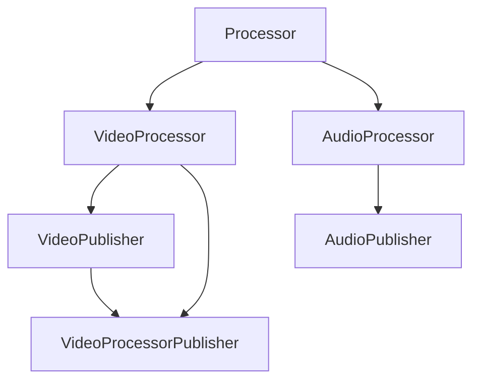
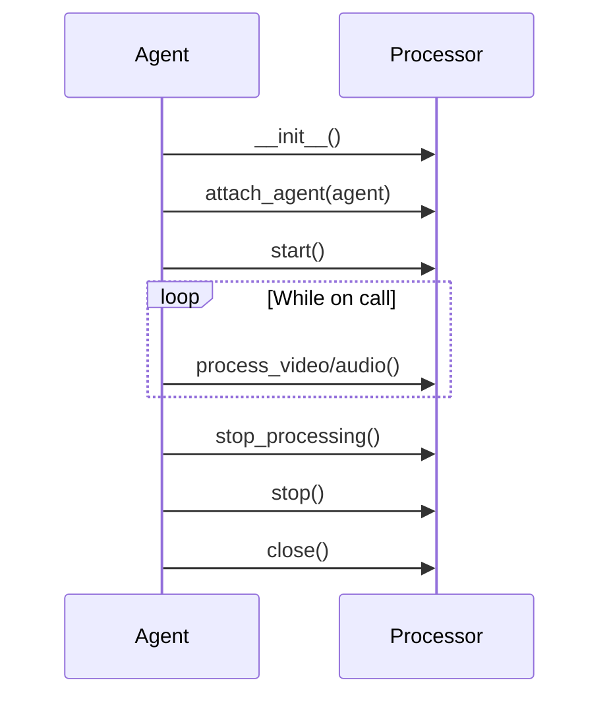

Processors allow you to analyze, transform, or augment audio and video streams in real-time. They run alongside agents to add custom capabilities like object detection, sentiment analysis, or visual effects.

## Overview

Processors are modular components that:

- Process incoming audio/video streams
- Publish outgoing processed streams back to calls
- Attach to agents and access agent functionality
- Run continuously or at intervals
- Provide state to LLMs for context-aware responses

## Processor Types

Vision Agents provides base classes for different processing scenarios:



### Base Processor

All processors extend this abstract base:

```python
from vision_agents.core.processors import Processor

class MyProcessor(Processor):
    @property
    def name(self) -> str:
        """Processor name for logging and identification."""
        return "my_processor"
    
    async def close(self) -> None:
        """Clean up resources when agent closes."""
        await self.cleanup()
    
    def attach_agent(self, agent: Agent) -> None:
        """Called when processor is attached to an agent."""
        self.agent = agent
        # Register custom events, access agent state, etc.
```

**Reference:** `base_processor.py:16-43`

## Video Processors

### VideoProcessor

Process incoming video streams:

```python
from vision_agents.core.processors import VideoProcessor
import aiortc

class ObjectDetector(VideoProcessor):
    @property
    def name(self) -> str:
        return "object_detector"
    
    async def process_video(
        self,
        track: aiortc.VideoStreamTrack,
        participant_id: Optional[str],
        shared_forwarder: Optional[VideoForwarder] = None,
    ) -> None:
        """Start processing a video track."""
        # Use shared forwarder or create new one
        forwarder = shared_forwarder or VideoForwarder(track)
        
        async for frame in forwarder:
            # Analyze frame
            detections = await self.detect_objects(frame)
            
            # Update processor state
            self.latest_detections = detections
    
    async def stop_processing(self) -> None:
        """Stop processing when video track is removed."""
        self.latest_detections = None
    
    async def close(self) -> None:
        """Clean up resources."""
        await self.stop_processing()
```

**Reference:** `base_processor.py:58-82`

### VideoPublisher

Publish outgoing video streams:

```python
from vision_agents.core.processors import VideoPublisher
import aiortc

class AvatarRenderer(VideoPublisher):
    @property
    def name(self) -> str:
        return "avatar_renderer"
    
    def publish_video_track(self) -> aiortc.VideoStreamTrack:
        """Return a video track with generated frames."""
        return self.avatar_track
    
    async def close(self) -> None:
        self.avatar_track.stop()
```

**Reference:** `base_processor.py:45-56`

### VideoProcessorPublisher

Process incoming video and publish transformed output:

```python
from vision_agents.core.processors import VideoProcessorPublisher
import aiortc
from av import VideoFrame

class AnnotationOverlay(VideoProcessorPublisher):
    """Overlay detection boxes on video."""
    
    @property
    def name(self) -> str:
        return "annotation_overlay"
    
    async def process_video(
        self,
        track: aiortc.VideoStreamTrack,
        participant_id: Optional[str],
        shared_forwarder: Optional[VideoForwarder] = None,
    ) -> None:
        """Process incoming video."""
        forwarder = shared_forwarder or VideoForwarder(track)
        
        async for frame in forwarder:
            # Draw annotations on frame
            annotated = self.draw_boxes(frame, self.detections)
            
            # Write to output track
            await self.output_track.write(annotated)
    
    def publish_video_track(self) -> aiortc.VideoStreamTrack:
        """Return the annotated video track."""
        return self.output_track
    
    async def stop_processing(self) -> None:
        self.output_track.stop()
    
    async def close(self) -> None:
        await self.stop_processing()
```

**Reference:** `base_processor.py:85-91`

## Audio Processors

### AudioProcessor

Process incoming audio streams:

```python
from vision_agents.core.processors import AudioProcessor
from getstream.video.rtc import PcmData

class SentimentAnalyzer(AudioProcessor):
    @property
    def name(self) -> str:
        return "sentiment_analyzer"
    
    async def process_audio(self, audio_data: PcmData) -> None:
        """Process audio data from participants."""
        # Access participant info
        participant = audio_data.participant
        
        # Analyze sentiment (accumulate audio, run inference)
        sentiment = await self.analyze_sentiment(
            audio_data.data,
            audio_data.sample_rate,
        )
        
        # Update state
        self.latest_sentiment = sentiment
    
    async def close(self) -> None:
        """Clean up."""
        self.latest_sentiment = None
```

**Reference:** `base_processor.py:102-115`

### AudioPublisher

Publish outgoing audio streams:

```python
from vision_agents.core.processors import AudioPublisher
import aiortc

class MusicGenerator(AudioPublisher):
    @property
    def name(self) -> str:
        return "music_generator"
    
    def publish_audio_track(self) -> aiortc.AudioStreamTrack:
        """Return an audio track with generated music."""
        return self.music_track
    
    async def close(self) -> None:
        self.music_track.stop()
```

**Reference:** `base_processor.py:93-100`

### AudioProcessorPublisher

Process incoming audio and publish transformed output:

```python
from vision_agents.core.processors import AudioProcessorPublisher
from getstream.video.rtc import PcmData
import aiortc

class NoiseFilter(AudioProcessorPublisher):
    """Remove background noise from audio."""
    
    @property
    def name(self) -> str:
        return "noise_filter"
    
    async def process_audio(self, audio_data: PcmData) -> None:
        """Process and filter audio."""
        # Apply noise reduction
        filtered = await self.denoise(
            audio_data.data,
            audio_data.sample_rate,
        )
        
        # Write to output track
        await self.output_track.write(filtered)
    
    def publish_audio_track(self) -> aiortc.AudioStreamTrack:
        """Return the filtered audio track."""
        return self.output_track
    
    async def close(self) -> None:
        self.output_track.stop()
```

**Reference:** `base_processor.py:117-121`

## Using Processors

### Attaching to Agents

Pass processors to the agent constructor:

```python
from vision_agents import Agent
from my_processors import ObjectDetector, SentimentAnalyzer

agent = Agent(
    # ... other config
    processors=[
        ObjectDetector(),
        SentimentAnalyzer(),
    ]
)
```

The agent automatically:
1. Calls `attach_agent()` on each processor
2. Routes video/audio to appropriate processors
3. Calls `start()` when joining a call
4. Calls `stop()` and `close()` during cleanup

**Reference:** `agents.py:249-250`

### Processor Lifecycle

Processors follow this lifecycle:



**Reference:** `agents.py:800-822`

## Accessing Agent State

Processors can access the agent they're attached to:

```python
class SmartProcessor(VideoProcessor):
    def attach_agent(self, agent: Agent) -> None:
        """Access agent functionality."""
        self.agent = agent
        
        # Subscribe to agent events
        @agent.subscribe
        async def on_llm_response(event):
            # React to LLM responses
            pass
        
        # Access agent properties
        self.llm = agent.llm
        self.conversation = agent.conversation
    
    async def process_video(self, track, participant_id, shared_forwarder):
        # Access agent state
        if self.agent.conversation:
            messages = await self.agent.conversation.get_messages()
            # Use conversation context for processing
```

**Reference:** `base_processor.py:34-42`

## Providing State to LLMs

Processors can provide context to LLM responses:

```python
class ObjectDetector(VideoProcessor):
    def __init__(self):
        self.detections = []
    
    async def process_video(self, track, participant_id, shared_forwarder):
        async for frame in shared_forwarder:
            self.detections = await self.detect(frame)
    
    def get_state(self) -> dict:
        """Called by agent when generating LLM context."""
        return {
            "detected_objects": self.detections,
            "object_count": len(self.detections),
        }

# In agent's LLM prompt:
# "Currently detected objects: {processor_state}"
```

The agent passes processor state to the LLM during `simple_response()`.

**Reference:** `agents.py:586-588`

## Video Track Management

### Shared Video Forwarders

Multiple processors can share the same video stream efficiently:

```python
async def process_video(
    self,
    track: aiortc.VideoStreamTrack,
    participant_id: Optional[str],
    shared_forwarder: Optional[VideoForwarder] = None,
) -> None:
    # Prefer shared forwarder to avoid duplicate frame reads
    if shared_forwarder:
        forwarder = shared_forwarder
    else:
        forwarder = VideoForwarder(track, fps=30)
    
    async for frame in forwarder:
        await self.process_frame(frame)
```

The agent creates one forwarder per video track and shares it with all processors.

**Reference:** `agents.py:1176-1190`

### Track Priority

Screen shares are prioritized over regular video:

```python
# Agent automatically routes highest-priority track
priority = 1 if track_type == TrackType.SCREEN_SHARE else 0

# Processors receive the highest-priority track
await self._track_to_video_processors(source_track)
```

**Reference:** `agents.py:1231-1237`

## Audio Track Management

### Per-Participant Audio

Audio processors receive PCM data with participant info:

```python
async def process_audio(self, audio_data: PcmData) -> None:
    # Access participant who sent the audio
    participant = audio_data.participant
    
    if participant:
        user_id = participant.user_id
        # Process audio differently per participant
```

**Reference:** `base_processor.py:108-114`

### Multi-Speaker Filtering

The agent filters audio before passing to processors:

```python
# In agent's audio consumer loop
if len(self._participant_queues) > 1:
    # Apply multi-speaker filter
    pcm = await self._multi_speaker_filter.process_audio(
        pcm, participant
    )
    if pcm is None:
        continue  # Filtered out

# Pass to audio processors
for processor in audio_processors:
    await processor.process_audio(pcm)
```

**Reference:** `agents.py:1121-1130`

## Performance Considerations

### Video Frame Rate

Control how many frames you process:

```python
class EfficientProcessor(VideoProcessor):
    async def process_video(self, track, participant_id, shared_forwarder):
        # Process at 1 FPS instead of 30 FPS
        forwarder = shared_forwarder or VideoForwarder(track, fps=1)
        
        async for frame in forwarder:
            # Heavy processing only runs 1x per second
            await self.expensive_inference(frame)
```

### Async Processing

Avoid blocking the event loop:

```python
class AsyncProcessor(VideoProcessor):
    async def process_video(self, track, participant_id, shared_forwarder):
        async for frame in shared_forwarder:
            # Don't block - process in background
            asyncio.create_task(self.process_frame_async(frame))
    
    async def process_frame_async(self, frame):
        # Long-running inference
        result = await self.model.predict(frame)
        self.latest_result = result
```

### Resource Cleanup

Always clean up in `close()`:

```python
class ResourcefulProcessor(VideoProcessor):
    def __init__(self):
        self.model = load_model()
        self.tasks = []
    
    async def process_video(self, track, participant_id, shared_forwarder):
        task = asyncio.create_task(self.process_loop(shared_forwarder))
        self.tasks.append(task)
    
    async def close(self) -> None:
        # Cancel all tasks
        for task in self.tasks:
            task.cancel()
        await asyncio.gather(*self.tasks, return_exceptions=True)
        
        # Unload model
        self.model.cleanup()
```

## Complete Example

Here's a full processor that detects objects and provides context to the LLM:

```python
from vision_agents.core.processors import VideoProcessor
from vision_agents.core.utils.video_forwarder import VideoForwarder
import aiortc
from typing import Optional
import asyncio

class ObjectDetectionProcessor(VideoProcessor):
    """Detect objects in video and provide context to LLM."""
    
    def __init__(self, model_path: str, fps: int = 1):
        self.model = self.load_model(model_path)
        self.fps = fps
        self.detections = []
        self.processing_task = None
        self.agent = None
    
    @property
    def name(self) -> str:
        return "object_detector"
    
    def attach_agent(self, agent) -> None:
        """Access agent for event subscriptions."""
        self.agent = agent
        
        # Register event listeners if needed
        @agent.subscribe
        async def on_turn_ended(event):
            # Clear detections on new turn
            self.detections = []
    
    async def process_video(
        self,
        track: aiortc.VideoStreamTrack,
        participant_id: Optional[str],
        shared_forwarder: Optional[VideoForwarder] = None,
    ) -> None:
        """Start processing video track."""
        forwarder = shared_forwarder or VideoForwarder(
            track, fps=self.fps, max_buffer=30
        )
        
        self.processing_task = asyncio.create_task(
            self._process_loop(forwarder)
        )
    
    async def _process_loop(self, forwarder: VideoForwarder):
        """Process frames from the forwarder."""
        try:
            async for frame in forwarder:
                # Run object detection
                detections = await self.detect_objects(frame)
                self.detections = detections
        except asyncio.CancelledError:
            pass
    
    async def detect_objects(self, frame):
        """Run inference on a frame."""
        # Convert frame to image
        img = frame.to_ndarray(format="rgb24")
        
        # Run model inference
        results = await self.model.predict(img)
        
        # Extract detections
        return [
            {
                "class": r.class_name,
                "confidence": r.confidence,
                "bbox": r.bbox,
            }
            for r in results
        ]
    
    def get_state(self) -> dict:
        """Provide state to LLM."""
        if not self.detections:
            return {"objects": "No objects detected"}
        
        object_summary = ", ".join(
            f"{d['class']} ({d['confidence']:.0%})"
            for d in self.detections
        )
        
        return {
            "detected_objects": object_summary,
            "object_count": len(self.detections),
        }
    
    async def stop_processing(self) -> None:
        """Stop processing video."""
        if self.processing_task:
            self.processing_task.cancel()
            await asyncio.gather(self.processing_task, return_exceptions=True)
            self.processing_task = None
        self.detections = []
    
    async def close(self) -> None:
        """Clean up resources."""
        await self.stop_processing()
        self.model.cleanup()
    
    def load_model(self, model_path: str):
        """Load object detection model."""
        # Load your model here
        return Model(model_path)

# Usage
agent = Agent(
    # ... other config
    processors=[
        ObjectDetectionProcessor(
            model_path="/models/yolo.pt",
            fps=1,  # Process 1 frame per second
        )
    ]
)
```

## Best Practices

1. **Use shared forwarders**: Always prefer `shared_forwarder` over creating new ones
2. **Process asynchronously**: Don't block the event loop with heavy computation
3. **Control frame rate**: Process at the minimum FPS needed for your use case
4. **Clean up properly**: Always implement `close()` and cancel tasks
5. **Provide useful state**: Make `get_state()` return LLM-friendly context
6. **Handle missing participants**: Check if `participant` is present before using it
7. **Use background tasks**: Process frames in separate tasks for parallelism
8. **Test resource cleanup**: Ensure no memory leaks when processors stop/start

## Code References

- **Base classes**: `base_processor.py:16-121`
- **Agent integration**: `agents.py:249-250`, `agents.py:1176-1190`
- **Video routing**: `agents.py:1217-1253`
- **Audio routing**: `agents.py:1102-1156`

## Next Steps

- Learn about [Agents](/concepts/agents) orchestration
- Explore [Edge Networks](/concepts/edge-networks) for media transport
- Understand [Realtime vs Interval](/concepts/realtime-vs-interval) processing modes