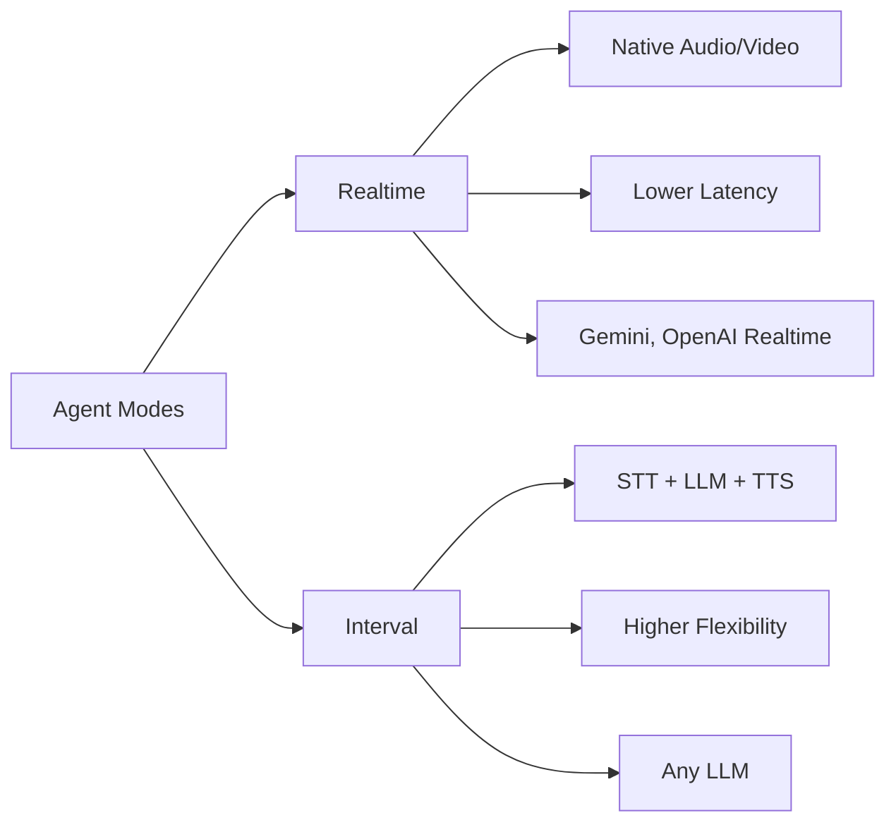
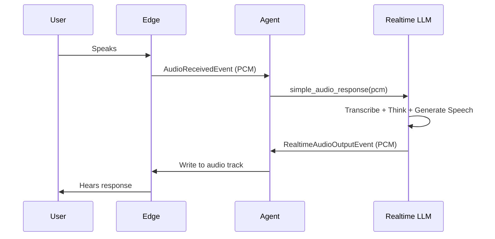
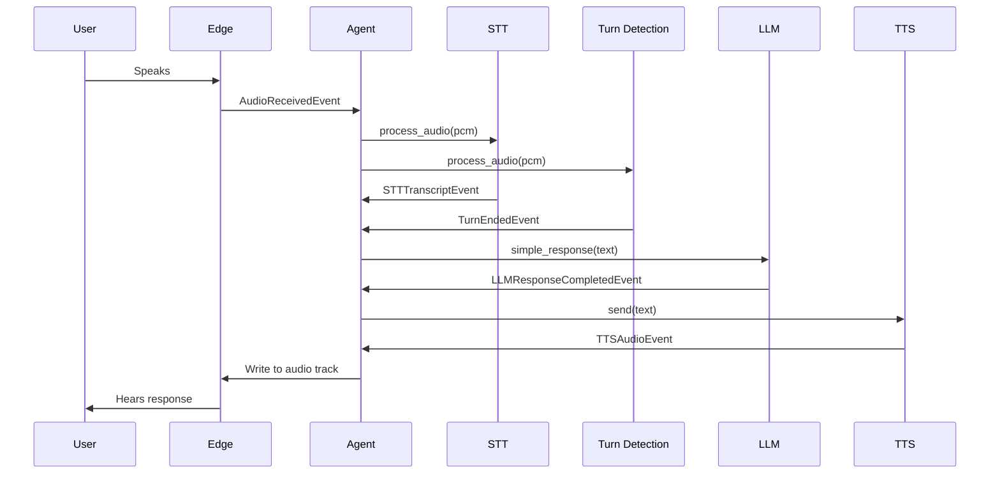

Vision Agents supports two distinct modes of operation: **Realtime** (using multimodal LLMs with native audio/video support) and **Interval** (using traditional LLMs with separate STT/TTS services). Each mode has different characteristics and use cases.

## Overview



## Realtime Mode

Realtime mode uses LLMs that process audio and video natively, eliminating the need for separate speech-to-text and text-to-speech services.

### Architecture



### Supported LLMs

#### Audio-Only Realtime (AudioLLM)

Processes audio directly without STT/TTS:

```python
from vision_agents.llm import openai
from vision_agents import Agent

agent = Agent(
    edge=edge,
    agent_user=user,
    llm=openai.Realtime(),  # No STT/TTS needed
    instructions="You are a voice assistant.",
)
```

**Reference:** `llm.py:375-395`

#### Omni Realtime (OmniLLM)

Processes both audio and video:

```python
from vision_agents.llm import gemini

agent = Agent(
    edge=edge,
    agent_user=user,
    llm=gemini.Realtime(fps=1),  # Audio + Video
    instructions="You can see and hear. Describe what you observe.",
)
```

**Reference:** `llm.py:426-432`, `realtime.py:18-198`

### Key Characteristics

**Advantages:**
- **Lower latency**: No transcription step, direct audio-to-audio
- **More natural speech**: LLM generates audio with proper intonation
- **Simpler architecture**: Fewer moving parts
- **Video understanding**: Some models (Gemini) can process video
- **Barge-in support**: Can interrupt agent mid-speech naturally

**Limitations:**
- **Provider lock-in**: Limited to LLMs with native audio/video
- **Less control**: Can't customize STT/TTS voice characteristics
- **Cost**: May be more expensive per interaction

### Configuration

```python
from vision_agents.llm import gemini
from vision_agents import Agent

agent = Agent(
    edge=edge,
    agent_user=user,
    llm=gemini.Realtime(
        fps=1,  # Video frames per second to send
    ),
    instructions="@system-prompt.md",
    # NO stt, tts, or turn_detection needed!
)
```

<Note>
Realtime LLMs handle turn detection internally. Don't provide `stt`, `tts`, or `turn_detection` parameters.
</Note>

**Reference:** `agents.py:109-122`, `realtime.py:39-48`

### Event Flow

Realtime mode emits these events:

```python
from vision_agents.core.llm.events import (
    RealtimeConnectedEvent,          # Connected to realtime service
    RealtimeAudioInputEvent,          # Audio sent to LLM
    RealtimeAudioOutputEvent,         # Audio received from LLM
    RealtimeUserSpeechTranscriptionEvent,   # User speech transcribed
    RealtimeAgentSpeechTranscriptionEvent,  # Agent speech transcribed
    RealtimeResponseEvent,            # Text response from LLM
)

@agent.subscribe
async def on_realtime_event(event: RealtimeAudioOutputEvent):
    # Process realtime audio output
    pcm_data = event.data
```

**Reference:** `realtime.py:64-198`

## Interval Mode

Interval mode uses traditional text-based LLMs with separate STT (speech-to-text), TTS (text-to-speech), and turn detection services.

### Architecture



### Components

#### Speech-to-Text (STT)

Transcribes user speech to text:

```python
from vision_agents.stt import deepgram

stt = deepgram.STT(
    model="nova-2",
    language="en-US",
)
```

#### Text-to-Speech (TTS)

Converts agent responses to audio:

```python
from vision_agents.tts import elevenlabs

tts = elevenlabs.TTS(
    voice_id="21m00Tcm4TlvDq8ikWAM",  # Rachel voice
    model="eleven_turbo_v2",
)
```

#### Turn Detection

Determines when user has finished speaking:

```python
from vision_agents.turn_detection import silero

turn_detection = silero.TurnDetector(
    confidence_threshold=0.5,
)
```

See [Turn Detection](/concepts/turn-detection) for details.

### Key Characteristics

**Advantages:**
- **Flexibility**: Mix and match any LLM, STT, and TTS providers
- **Customization**: Full control over voice, accent, speed, etc.
- **Cost optimization**: Choose cheaper providers for each component
- **Wider LLM support**: Use any text-based LLM (GPT-4, Claude, etc.)
- **Fine-tuned voices**: Use custom TTS voices

**Limitations:**
- **Higher latency**: Audio → STT → LLM → TTS → Audio pipeline
- **More complex**: Requires configuring multiple services
- **Less natural**: TTS voices may sound robotic
- **Turn detection challenges**: Detecting when user finished speaking

### Configuration

```python
from vision_agents import Agent
from vision_agents.llm import openai
from vision_agents.stt import deepgram
from vision_agents.tts import elevenlabs
from vision_agents.turn_detection import silero

agent = Agent(
    edge=edge,
    agent_user=user,
    llm=openai.LLM(model="gpt-4o"),
    stt=deepgram.STT(),
    tts=elevenlabs.TTS(),
    turn_detection=silero.TurnDetector(),
    instructions="You are a helpful assistant.",
)
```

**Reference:** `agents.py:109-143`

### Event Flow

Interval mode emits these events:

```python
from vision_agents.core.stt.events import (
    STTTranscriptEvent,        # Complete transcript
    STTPartialTranscriptEvent, # Partial transcript (streaming)
)
from vision_agents.core.tts.events import (
    TTSAudioEvent,            # TTS audio chunk
)
from vision_agents.core.turn_detection import (
    TurnStartedEvent,         # User started speaking
    TurnEndedEvent,           # User finished speaking
)
from vision_agents.core.llm.events import (
    LLMResponseCompletedEvent,  # LLM response complete
    LLMResponseChunkEvent,      # LLM streaming chunk
)

@agent.subscribe
async def on_transcript(event: STTTranscriptEvent):
    print(f"User said: {event.text}")
```

**Reference:** `agents.py:323-476`

### Streaming TTS

Reduce perceived latency by streaming LLM chunks to TTS:

```python
agent = Agent(
    # ... other config
    streaming_tts=True,  # Send sentences to TTS as they complete
)
```

The agent accumulates LLM response chunks and sends complete sentences to TTS immediately instead of waiting for the full response.

**Reference:** `agents.py:363-383`

## Comparison Table

| Feature | Realtime Mode | Interval Mode |
|---------|--------------|---------------|
| **Latency** | Low (200-500ms) | Higher (1-3s) |
| **Setup Complexity** | Simple (LLM only) | Complex (LLM + STT + TTS + Turn Detection) |
| **LLM Options** | Limited (Gemini, OpenAI) | Any text LLM |
| **Voice Customization** | Limited | Full control |
| **Video Support** | Yes (Gemini) | Via processors |
| **Cost** | Higher per interaction | Flexible, can optimize |
| **Natural Speech** | Very natural | Depends on TTS quality |
| **Barge-in** | Native support | Requires careful tuning |
| **Use Case** | Voice assistants, video calls | Phone bots, custom workflows |

## Choosing a Mode

### Use Realtime When:

- **Low latency is critical** - Voice assistants, customer support
- **Natural speech matters** - User-facing applications
- **Video understanding needed** - Visual analysis, demos
- **Simplicity preferred** - Prototyping, MVPs

### Use Interval When:

- **Need specific LLM** - Must use GPT-4, Claude, etc.
- **Custom voices required** - Brand-specific TTS voices
- **Cost optimization important** - High volume, budget constraints
- **Complex workflows** - Multi-step processes, integrations
- **Fine-grained control** - Custom turn detection, audio processing

## Mode Detection

The agent automatically detects mode based on LLM type:

```python
# Internal agent logic
def _is_realtime_llm(llm: LLM) -> bool:
    return isinstance(llm, Realtime)

def _is_audio_llm(llm: LLM) -> bool:
    return isinstance(llm, AudioLLM)

def _is_video_llm(llm: LLM) -> bool:
    return isinstance(llm, VideoLLM)

# Skip STT/TTS in event handlers if realtime
if _is_audio_llm(self.llm):
    return  # Don't process STT events
```

**Reference:** `agents.py:1328-1349`

## Hybrid Approaches

### Video Processing in Interval Mode

Use processors for video analysis with interval mode:

```python
from my_processors import ObjectDetector

agent = Agent(
    llm=openai.LLM(model="gpt-4o"),
    stt=deepgram.STT(),
    tts=elevenlabs.TTS(),
    turn_detection=silero.TurnDetector(),
    processors=[
        ObjectDetector(),  # Provides video context to text LLM
    ],
)
```

The processor analyzes video and provides detections as context to the LLM.

### Streaming TTS with Traditional LLMs

Get near-realtime performance with interval mode:

```python
agent = Agent(
    llm=openai.LLM(model="gpt-4o"),  # Supports streaming
    stt=deepgram.STT(),
    tts=elevenlabs.TTS(),
    turn_detection=silero.TurnDetector(),
    streaming_tts=True,  # Stream sentences to TTS
)
```

This reduces latency by starting TTS before the full LLM response completes.

**Reference:** `agents.py:363-383`

## Configuration Validation

The agent validates mode configuration on init:

```python
def _validate_configuration(self):
    """Ensure realtime LLMs don't have STT/TTS."""
    if isinstance(self.llm, Realtime):
        if self.stt or self.tts or self.turn_detection:
            raise ValueError(
                "Realtime LLMs handle audio directly. "
                "Don't provide stt, tts, or turn_detection."
            )
```

**Reference:** `agents.py:277`

## Migration Guide

### From Interval to Realtime

Before:
```python
agent = Agent(
    edge=edge,
    agent_user=user,
    llm=openai.LLM(model="gpt-4o"),
    stt=deepgram.STT(),
    tts=elevenlabs.TTS(),
    turn_detection=silero.TurnDetector(),
    instructions="You are helpful.",
)
```

After:
```python
agent = Agent(
    edge=edge,
    agent_user=user,
    llm=gemini.Realtime(fps=1),
    # Remove stt, tts, turn_detection
    instructions="You are helpful.",
)
```

### From Realtime to Interval

Before:
```python
agent = Agent(
    edge=edge,
    agent_user=user,
    llm=gemini.Realtime(fps=1),
    instructions="You are helpful.",
)
```

After:
```python
agent = Agent(
    edge=edge,
    agent_user=user,
    llm=openai.LLM(model="gpt-4o"),
    stt=deepgram.STT(),
    tts=elevenlabs.TTS(),
    turn_detection=silero.TurnDetector(),
    instructions="You are helpful.",
    streaming_tts=True,  # Reduce latency
)
```

## Best Practices

1. **Start with realtime**: Prototype with realtime for simplicity, migrate to interval if needed
2. **Use streaming TTS**: Enable `streaming_tts=True` in interval mode for better UX
3. **Tune turn detection**: Spend time configuring turn detection in interval mode
4. **Monitor latency**: Track end-to-end latency and optimize bottlenecks
5. **Test barge-in**: Ensure interruptions work smoothly in your chosen mode
6. **Consider hybrid**: Use processors for video analysis even in realtime mode

## Code References

- **Realtime base class**: `realtime.py:18-198`
- **AudioLLM interface**: `llm.py:375-395`
- **VideoLLM interface**: `llm.py:397-424`
- **OmniLLM interface**: `llm.py:426-432`
- **Agent mode detection**: `agents.py:1328-1349`
- **Event handling differences**: `agents.py:323-476`
- **Streaming TTS**: `agents.py:363-383`

## Next Steps

- Learn about [Turn Detection](/concepts/turn-detection) for interval mode
- Explore [Function Calling](/concepts/function-calling) in both modes
- Understand [Agents](/concepts/agents) orchestration
- Review [Processors](/concepts/processors) for video analysis