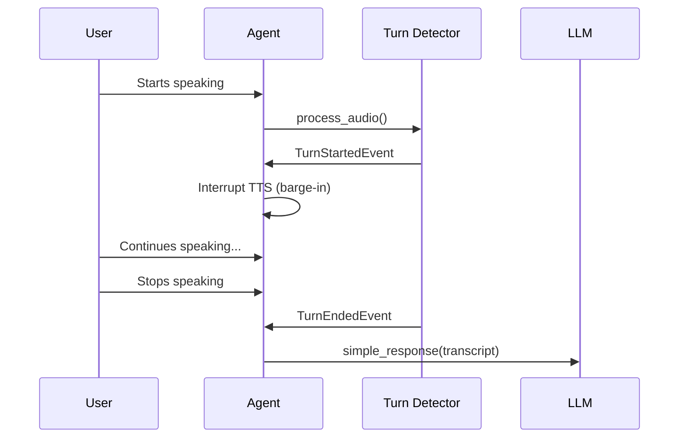

Turn detection determines when a user has finished speaking and it's the agent's turn to respond. This is critical for natural conversations in interval mode (realtime LLMs handle this internally).

## Overview

Turn detection analyzes audio to identify:

- **Turn started**: User began speaking
- **Turn ended**: User finished speaking, agent should respond
- **Trailing silence**: Duration of silence after speech
- **Confidence**: How confident we are the turn has ended



## TurnDetector Interface

All turn detectors extend this abstract base:

```python
from vision_agents.core.turn_detection import TurnDetector
from vision_agents.core.turn_detection.events import TurnStartedEvent, TurnEndedEvent
from getstream.video.rtc import PcmData
from vision_agents.core.edge.types import Participant

class MyTurnDetector(TurnDetector):
    def __init__(self, confidence_threshold: float = 0.5):
        super().__init__(confidence_threshold)
        # Initialize VAD model, silence detection, etc.
    
    async def process_audio(
        self,
        audio_data: PcmData,
        participant: Participant,
        conversation: Optional[Conversation],
    ) -> None:
        """Analyze audio and emit turn events."""
        # Detect speech activity
        is_speech = self.detect_speech(audio_data)
        
        if is_speech and not self.is_active:
            # Speech started
            self._emit_start_turn_event(
                TurnStartedEvent(
                    participant=participant,
                    confidence=0.9,
                )
            )
            self.is_active = True
        
        elif not is_speech and self.is_active:
            # Speech ended
            self._emit_end_turn_event(
                participant=participant,
                confidence=0.95,
                trailing_silence_ms=self.silence_duration_ms,
            )
            self.is_active = False
    
    async def start(self) -> None:
        """Initialize detector when agent joins call."""
        await super().start()
        # Warmup models, connect to services, etc.
    
    async def stop(self) -> None:
        """Clean up when agent leaves call."""
        await super().stop()
        # Cleanup resources
```

**Reference:** `turn_detection.py:20-83`

## Base Class Features

The `TurnDetector` base class provides:

### Configuration

```python
class TurnDetector:
    def __init__(
        self,
        confidence_threshold: float = 0.5,
        provider_name: Optional[str] = None,
    ):
        self._confidence_threshold = confidence_threshold
        self.is_active = False  # Currently in a turn
        self.session_id = str(uuid.uuid4())  # Unique session ID
        self.provider_name = provider_name or self.__class__.__name__
        self.events = EventManager()
```

**Reference:** `turn_detection.py:23-31`

### Event Emission

Helper methods for emitting events:

```python
def _emit_start_turn_event(self, event: TurnStartedEvent) -> None:
    """Emit a turn started event."""
    event.session_id = self.session_id
    event.plugin_name = self.provider_name
    self.events.send(event)

def _emit_end_turn_event(
    self,
    participant: Participant,
    confidence: Optional[float] = None,
    trailing_silence_ms: Optional[float] = None,
    duration_ms: Optional[float] = None,
    eager_end_of_turn: bool = False,
) -> None:
    """Emit a turn ended event."""
    event = TurnEndedEvent(
        session_id=self.session_id,
        plugin_name=self.provider_name,
        participant=participant,
        confidence=confidence or 0.5,
        trailing_silence_ms=trailing_silence_ms,
        duration_ms=duration_ms,
        eager_end_of_turn=eager_end_of_turn,
    )
    self.events.send(event)
```

**Reference:** `turn_detection.py:33-57`

## Turn Events

### TurnStartedEvent

Emitted when a user starts speaking:

```python
from vision_agents.core.turn_detection.events import TurnStartedEvent

@dataclass
class TurnStartedEvent:
    participant: Participant     # Who started speaking
    confidence: float            # Confidence score (0-1)
    session_id: str             # Turn detector session ID
    plugin_name: str            # Provider name
```

**Reference:** `events.py:TurnStartedEvent`

### TurnEndedEvent

Emitted when a user finishes speaking:

```python
from vision_agents.core.turn_detection.events import TurnEndedEvent

@dataclass
class TurnEndedEvent:
    participant: Participant          # Who finished speaking
    confidence: float                 # Confidence score (0-1)
    trailing_silence_ms: Optional[float]  # Silence duration
    duration_ms: Optional[float]      # Turn duration
    eager_end_of_turn: bool          # Eager completion (see below)
    session_id: str                  # Turn detector session ID
    plugin_name: str                 # Provider name
```

**Reference:** `events.py:TurnEndedEvent`

## Agent Integration

The agent handles turn events automatically:

```python
# In agent.setup_event_handling()
@self.events.subscribe
async def on_turn_event(event: TurnStartedEvent | TurnEndedEvent):
    if isinstance(event, TurnStartedEvent):
        # User started speaking - interrupt TTS (barge-in)
        if event.participant.user_id != self.agent_user.id:
            if self.tts:
                await self.tts.stop_audio()
                self._streaming_tts_buffer = ""
            if self._audio_track:
                await self._audio_track.flush()
    
    elif isinstance(event, TurnEndedEvent):
        # User finished speaking - generate response
        transcript = self._pending_user_transcripts[user_id].get_text()
        await self.simple_response(transcript, event.participant)
```

**Reference:** `agents.py:1301-1327`

## Barge-In Support

When a user starts speaking while the agent is talking, the agent interrupts itself:

```python
if isinstance(event, TurnStartedEvent):
    if event.participant.user_id != self.agent_user.id:
        # User started speaking - stop agent
        if self.tts:
            self.logger.info("Turn started - interrupting TTS")
            await self.tts.stop_audio()
            self._streaming_tts_buffer = ""
        if self._audio_track:
            await self._audio_track.flush()
```

**Reference:** `agents.py:1308-1327`

## Without Turn Detection

If you don't provide a turn detector, the agent treats each STT transcript as a turn end:

```python
# In agent event handling
if not self.turn_detection_enabled and isinstance(
    event, STTTranscriptEvent
):
    # Treat transcript as end of turn
    self.events.send(
        TurnEndedEvent(
            participant=event.participant,
        )
    )
```

This works but may feel less natural since it can't detect pauses mid-sentence.

**Reference:** `agents.py:461-468`

## Eager End-of-Turn

Some turn detectors support eager completion, where they signal a likely turn end before the user fully stops speaking:

```python
def _emit_end_turn_event(
    self,
    participant: Participant,
    eager_end_of_turn: bool = False,  # Signal early completion
):
    # ...
```

This can reduce latency but risks interrupting the user mid-sentence.

**Reference:** `turn_detection.py:44`

## Configuration

### Basic Setup

```python
from vision_agents.turn_detection import silero

agent = Agent(
    # ... other config
    turn_detection=silero.TurnDetector(
        confidence_threshold=0.5,  # Adjust sensitivity
    ),
)
```

### Confidence Threshold

Control how confident the detector must be:

```python
turn_detection = MyTurnDetector(
    confidence_threshold=0.7,  # Higher = more conservative
)

# In detector:
if confidence >= self._confidence_threshold:
    self._emit_end_turn_event(...)
```

Lower thresholds make the agent more responsive but may trigger false positives.

**Reference:** `turn_detection.py:24`

### Session ID

Each detector instance gets a unique session ID:

```python
self.session_id = str(uuid.uuid4())
```

This helps track turn events across multiple agents or calls.

**Reference:** `turn_detection.py:28`

## Conversation Context

Turn detectors receive conversation history for context-aware detection:

```python
async def process_audio(
    self,
    audio_data: PcmData,
    participant: Participant,
    conversation: Optional[Conversation],  # Access chat history
) -> None:
    if conversation:
        # Use conversation to inform turn detection
        recent_messages = await conversation.get_messages(limit=5)
        # Adjust detection based on conversation flow
```

**Reference:** `turn_detection.py:60-65`

## Implementation Examples

### Silence-Based Detection

Simple detector based on silence duration:

```python
from vision_agents.core.turn_detection import TurnDetector
import time

class SilenceTurnDetector(TurnDetector):
    def __init__(self, silence_threshold_ms: float = 500):
        super().__init__()
        self.silence_threshold_ms = silence_threshold_ms
        self.speech_start_time = None
        self.silence_start_time = None
    
    async def process_audio(self, audio_data, participant, conversation):
        # Simple energy-based speech detection
        energy = self.calculate_energy(audio_data.data)
        is_speech = energy > 0.01
        
        current_time = time.time() * 1000
        
        if is_speech:
            if not self.is_active:
                # Speech started
                self._emit_start_turn_event(
                    TurnStartedEvent(
                        participant=participant,
                        confidence=0.9,
                    )
                )
                self.is_active = True
                self.speech_start_time = current_time
            
            # Reset silence timer
            self.silence_start_time = None
        
        else:
            if self.is_active:
                if self.silence_start_time is None:
                    # Silence started
                    self.silence_start_time = current_time
                
                else:
                    # Check silence duration
                    silence_duration = current_time - self.silence_start_time
                    
                    if silence_duration >= self.silence_threshold_ms:
                        # Turn ended
                        turn_duration = current_time - self.speech_start_time
                        
                        self._emit_end_turn_event(
                            participant=participant,
                            confidence=0.95,
                            trailing_silence_ms=silence_duration,
                            duration_ms=turn_duration,
                        )
                        
                        self.is_active = False
                        self.speech_start_time = None
                        self.silence_start_time = None
    
    def calculate_energy(self, audio_data: bytes) -> float:
        """Calculate audio energy."""
        # Convert bytes to numpy array and calculate RMS energy
        import numpy as np
        samples = np.frombuffer(audio_data, dtype=np.int16)
        return np.sqrt(np.mean(samples**2)) / 32768.0
    
    async def close(self):
        pass
```

### VAD-Based Detection

Use Voice Activity Detection models:

```python
from vision_agents.core.turn_detection import TurnDetector
import torch

class VADTurnDetector(TurnDetector):
    def __init__(self, model_path: str, silence_ms: float = 700):
        super().__init__()
        self.model = torch.jit.load(model_path)
        self.silence_ms = silence_ms
        self.silence_counter = 0
    
    async def process_audio(self, audio_data, participant, conversation):
        # Run VAD on audio chunk
        speech_prob = self.run_vad(audio_data)
        
        if speech_prob > 0.5:
            # Speech detected
            if not self.is_active:
                self._emit_start_turn_event(
                    TurnStartedEvent(
                        participant=participant,
                        confidence=speech_prob,
                    )
                )
                self.is_active = True
            
            self.silence_counter = 0
        
        else:
            # No speech
            if self.is_active:
                self.silence_counter += 20  # 20ms chunks
                
                if self.silence_counter >= self.silence_ms:
                    self._emit_end_turn_event(
                        participant=participant,
                        confidence=0.95,
                        trailing_silence_ms=self.silence_counter,
                    )
                    self.is_active = False
                    self.silence_counter = 0
    
    def run_vad(self, audio_data):
        """Run VAD model inference."""
        # Convert to tensor and run model
        # Return probability of speech
        pass
    
    async def close(self):
        del self.model
```

## Best Practices

1. **Tune silence threshold**: Balance responsiveness vs false positives
2. **Use VAD models**: More accurate than simple energy detection
3. **Consider conversation context**: Adjust detection based on dialogue flow
4. **Test with real users**: Synthetic tests don't capture natural pauses
5. **Monitor confidence scores**: Log and analyze turn detection accuracy
6. **Support barge-in**: Ensure TurnStartedEvent properly interrupts TTS
7. **Handle edge cases**: Quick responses, long pauses, background noise

## Debugging

Log turn events for analysis:

```python
@agent.subscribe
async def on_turn_started(event: TurnStartedEvent):
    logger.info(
        f"Turn started: {event.participant.user_id}, "
        f"confidence: {event.confidence}"
    )

@agent.subscribe
async def on_turn_ended(event: TurnEndedEvent):
    logger.info(
        f"Turn ended: {event.participant.user_id}, "
        f"silence: {event.trailing_silence_ms}ms, "
        f"duration: {event.duration_ms}ms, "
        f"confidence: {event.confidence}"
    )
```

## Realtime Mode

Realtime LLMs handle turn detection internally:

```python
from vision_agents.llm import gemini

agent = Agent(
    llm=gemini.Realtime(),
    # NO turn_detection parameter!
)
```

Don't provide a turn detector when using realtime LLMs.

**Reference:** `agents.py:120-122`

## Code References

- **TurnDetector base class**: `turn_detection.py:20-83`
- **Turn events**: `events.py`
- **Agent integration**: `agents.py:1301-1327`
- **Barge-in handling**: `agents.py:1308-1327`
- **Without turn detection**: `agents.py:461-468`

## Next Steps

- Compare [Realtime vs Interval](/concepts/realtime-vs-interval) modes
- Learn about [Agents](/concepts/agents) orchestration
- Explore [Function Calling](/concepts/function-calling) for tool use
- Understand [Processors](/concepts/processors) for custom logic