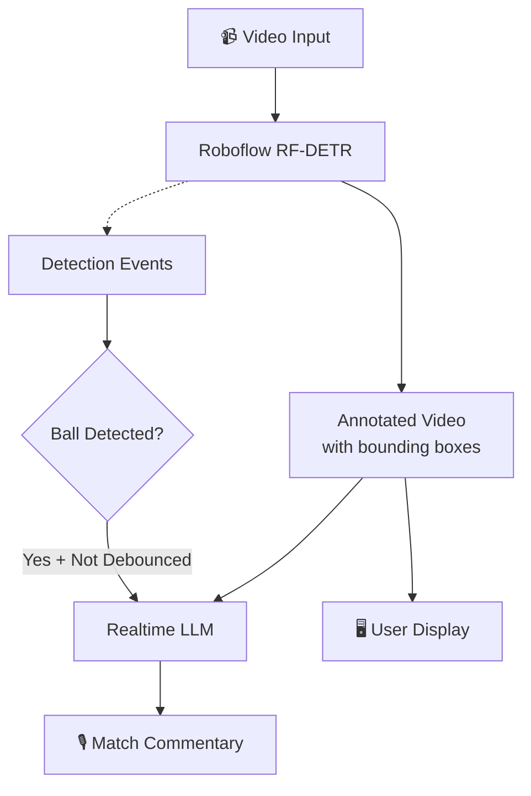

This example demonstrates how to build a real-time AI sports commentator using Vision Agents. It combines Roboflow's object detection for player and ball tracking with realtime LLMs to provide live commentary on football matches.

## What You'll Learn

- Using event-driven architecture with processors
- Subscribing to detection events from Roboflow
- Implementing debouncing to control LLM calls
- Combining object detection with realtime video analysis
- Detecting game events (ball disappearance/reappearance)

## Features

- Real-time player and ball detection using Roboflow
- Event-driven commentary triggered by game action
- Debounced LLM calls to avoid overwhelming the model
- Annotated video with bounding boxes
- Works with both OpenAI Realtime and Gemini Live

## Architecture

The system uses a two-model approach:



1. Video input is sent to Roboflow's RF-DETR model
2. Detections emit events and annotate the video with bounding boxes
3. When detection criteria are met (ball detected + not debounced), the LLM is prompted
4. The realtime model provides commentary on the match event

## Prerequisites

You'll need API keys for:

- [Stream](https://getstream.io/) (for video/audio infrastructure)
- [OpenAI](https://openai.com) or [Gemini](https://ai.google.dev/) (for realtime LLM)
- [Roboflow](https://roboflow.com/) (automatic, no key needed for local models)

## Setup

<Steps>
  <Step title="Navigate to the example directory">
    ```bash
    cd examples/04_football_commentator_example
    ```
  </Step>

  <Step title="Install dependencies">
    ```bash
    uv sync
    ```
  </Step>

  <Step title="Configure environment variables">
    Create a `.env` file:
    ```bash
    STREAM_API_KEY=your_stream_key
    STREAM_API_SECRET=your_stream_secret
    OPENAI_API_KEY=your_openai_key  # or GEMINI_API_KEY
    ```
  </Step>

  <Step title="Run the example">
    ```bash
    uv run football_commentator_example.py run
    ```
    
    The agent will:
    1. Create a video call
    2. Open a demo UI in your browser
    3. Start detecting players and the ball
    4. Provide commentary when the ball is detected
  </Step>
</Steps>

## Complete Code

```python
import logging
import random

from dotenv import load_dotenv
from utils import Debouncer
from vision_agents.core import Agent, Runner, User
from vision_agents.core.agents import AgentLauncher
from vision_agents.plugins import getstream, openai, roboflow

logger = logging.getLogger(__name__)

load_dotenv()


async def create_agent(**kwargs) -> Agent:
    llm = openai.Realtime()

    agent = Agent(
        edge=getstream.Edge(),
        agent_user=User(name="AI Sports Commentator", id="agent"),
        instructions="Read @instructions.md",
        processors=[
            roboflow.RoboflowLocalDetectionProcessor(
                classes=["person", "sports ball"],
                conf_threshold=0.5,
                fps=5,
            )
        ],
        llm=llm,
    )

    # Commentary prompts to rotate through
    questions = [
        "Provide an update on the situation on the football field.",
        "What has just happened?",
        "What is happening on the field right now?",
    ]

    # Debouncer: call LLM at most once every 8 seconds
    debouncer = Debouncer(8)

    @agent.events.subscribe
    async def on_detection_completed(event: roboflow.DetectionCompletedEvent):
        """
        Trigger commentary when Roboflow detects objects.
        
        Uses debouncer to avoid calling the LLM too frequently.
        """
        ball_detected = bool(
            [obj for obj in event.objects if obj["label"] == "sports ball"]
        )
        
        # Only comment when ball is detected and debouncer allows
        if ball_detected and debouncer:
            await agent.simple_response(random.choice(questions))

    return agent


async def join_call(agent: Agent, call_type: str, call_id: str, **kwargs) -> None:
    call = await agent.create_call(call_type, call_id)

    async with agent.join(call):
        await agent.finish()


if __name__ == "__main__":
    Runner(AgentLauncher(create_agent=create_agent, join_call=join_call)).cli()
```

## Code Walkthrough

### Roboflow Detection Processor

The processor handles real-time object detection:

```python
processors=[
    roboflow.RoboflowLocalDetectionProcessor(
        classes=["person", "sports ball"],  # Only detect these objects
        conf_threshold=0.5,  # Confidence threshold (0-1)
        fps=5,  # Process 5 frames per second
    )
]
```

**Configuration choices:**

- `classes`: Filters detections to specific object types
- `conf_threshold=0.5`: Low enough to catch the ball in motion, high enough to avoid false positives
- `fps=5`: Fast enough to track movement without overwhelming the system

### Event Subscription

Subscribe to detection events to trigger actions:

```python
@agent.events.subscribe
async def on_detection_completed(event: roboflow.DetectionCompletedEvent):
    ball_detected = bool(
        [obj for obj in event.objects if obj["label"] == "sports ball"]
    )
    
    if ball_detected and debouncer:
        await agent.simple_response(random.choice(questions))
```

The event contains:
- `event.objects`: List of detected objects with labels, bounding boxes, and confidence scores
- `event.timestamp`: When the detection occurred
- `event.frame`: The video frame (optional)

### Debouncing

Without debouncing, the agent would call the LLM every time a detection occurs (potentially many times per second). The `Debouncer` class limits calls:

```python
debouncer = Debouncer(8)  # Maximum one call every 8 seconds

if ball_detected and debouncer:  # debouncer returns True if enough time has passed
    await agent.simple_response(random.choice(questions))
```

The `Debouncer` utility (from `utils.py`):

```python
class Debouncer:
    def __init__(self, interval: float):
        self.interval = interval
        self.last_time = 0.0
    
    def __bool__(self) -> bool:
        now = time.time()
        if now - self.last_time >= self.interval:
            self.last_time = now
            return True
        return False
```

## Instructions File

The `instructions.md` file provides context for the LLM:

```markdown
You are an AI football commentator.
You will be shown a video of parts of a football match, and you need to analyze the events.

When asked what is going on right now, describe what you can see and the events taking place.
You may be asked with some regularity, don't sensationalize or add events - many could be 
mundane, normal things that occur in a football match!

It may make more sense to talk about ball possession, positioning, direction of play etc. 
depending on the context you're given.

Keep the replies very short, a few words max.
The colored boxes around the players and the ball are there to help you better detect objects.
Reply in English without using special symbols.
```

## Switching Between LLM Providers

Vision Agents makes it easy to swap models:

```python
# OpenAI Realtime
from vision_agents.plugins import openai
llm = openai.Realtime()

# Gemini Live
from vision_agents.plugins import gemini
llm = gemini.Realtime()
```

The rest of the code works identically with either provider.

## Advanced: Event-Based Detection

Instead of time-based debouncing, you can detect specific game events. For example, detecting when the ball reappears after disappearing (suggesting a fast play):

```python
ball_was_present = False

@agent.events.subscribe
async def on_detection_completed(event: roboflow.DetectionCompletedEvent):
    nonlocal ball_was_present
    
    ball_detected = bool(
        [obj for obj in event.objects if obj["label"] == "sports ball"]
    )
    
    # Trigger when ball comes back after being gone
    if ball_detected and not ball_was_present and debouncer:
        await agent.simple_response(
            "A play has just been made! Describe what happened, and the outcome"
        )
    
    ball_was_present = ball_detected
```

This approach provides more context to the LLM about what type of event occurred.

## Performance Benchmarks

From real-world testing with ~30 prompts per configuration:

| Provider | FPS | Mean TTFA | StdDev | Min | Max |
|----------|-----|-----------|--------|-----|-----|
| OpenAI Realtime | 1 | 0.39s | 0.10s | 0.31s | 0.72s |
| OpenAI Realtime | 2 | 0.47s | 0.22s | 0.32s | 1.20s |
| Gemini Live | 1 | 3.06s | 0.88s | 1.52s | 5.05s |
| Gemini Live | 2 | 4.08s | 1.04s | 2.75s | 6.85s |

**TTFA** = Time to First Audio (from prompt to first audio output)

**Findings:**
- OpenAI Realtime is ~8x faster to respond
- Higher FPS doesn't improve latency (may worsen it slightly)
- OpenAI has more consistent latency (WebRTC vs WebSocket)

## Limitations & Future Improvements

Current realtime models struggle with fast-action sports because:

1. **Limited video context**: Models seem to reason over just a few frames
2. **High-motion inference**: Fast action causes accuracy issues
3. **Latency**: 2-4s response time is too slow for live commentary

This example works as a demo but would need improvements for production:

- Static camera angle and better footage quality
- More sophisticated event detection (actual game events, not just ball tracking)
- Potentially replacing realtime models with: Detection → Event logic → LLM → TTS

## Use Cases Beyond Sports

This event-driven pattern works well for:

- Security monitoring (alert on specific detections)
- Manufacturing QA (comment on defects)
- Wildlife observation (identify and describe animals)
- Traffic analysis (report on congestion, accidents)
- Retail analytics (customer behavior insights)

## Next Steps

- Try the [Security Camera Example](/examples/security-camera) for more advanced object tracking
- Explore the [Golf Coach Example](/examples/golf-coach) for pose-based analysis
- Read the [Processors Guide](/guides/custom-processors) for building custom processors
